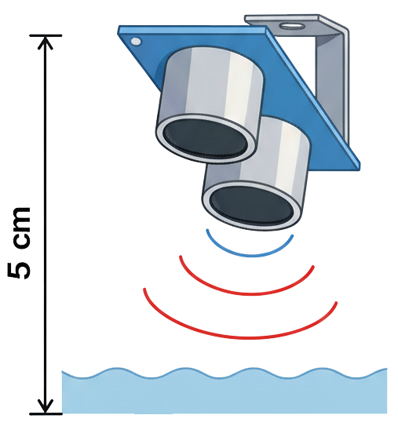
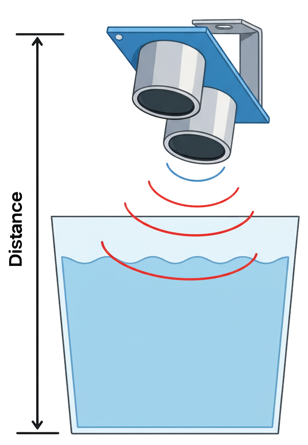

## Mount the Tank Sensor

--- task ---
Place the **ultrasonic sensor** above your water container so it faces straight down toward the surface.

Keep the sensor at least 5 cm above the maximum water level.

{:width="300px"} 
--- /task ---

--- task ---
Fix the sensor using tape, a clip, or a small bracket.  
Make sure it stays dry and perpendicular to the water surface for accurate readings.
--- /task ---

--- task ---
Measure the distance from the sensor to just above the bottom of the tank.  
You’ll use this to decide when the tank is “too empty”.

{:width="300px"} 
--- /task ---
