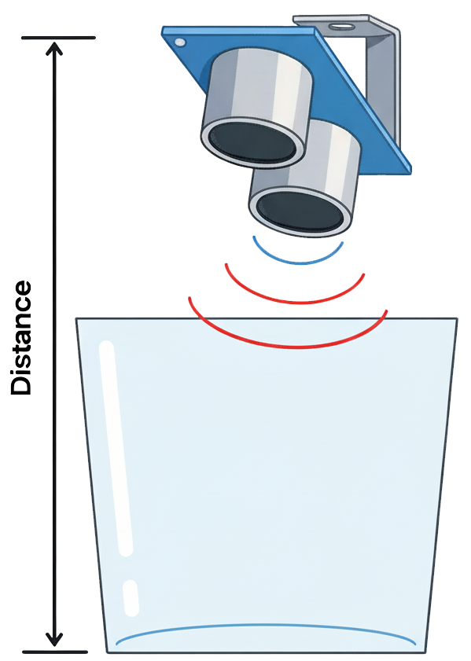

## Program the Sensor

--- task ---
Open Thonny and create a new file called `tank_sensor.py`.
--- /task ---

--- task ---
Add code to measure distance using the ultrasonic sensor.

--- code ---
---
language: python
filename: tank_sensor.py
line_numbers: true
---

from picozero import DistanceSensor
from time import sleep

sensor = DistanceSensor(echo=2, trigger=3)

while True:
    d = sensor.distance
    print("Distance:", round(d, 2), "m")
    sleep(0.5)
--- /code ---

--- /task ---

--- task ---
Click **Run**.  
Move your hand below the sensor — the distance values should change.
--- /task ---

--- task ---
Note the distance from the sensor when the tank is empty.  
This will help set your threshold in the next step.
{:width="300px"} 

--- /task ---
