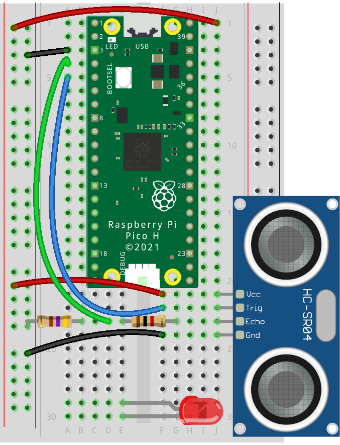
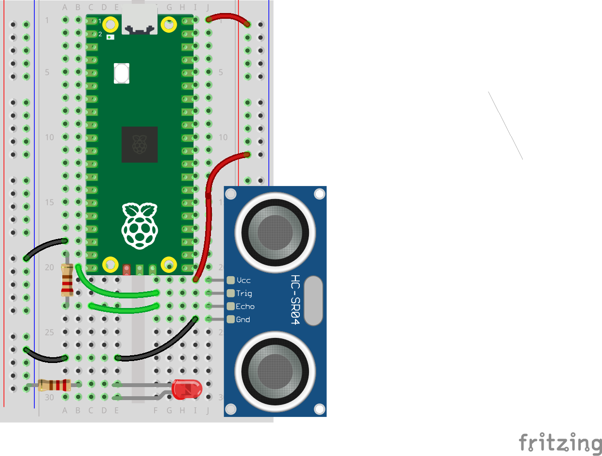
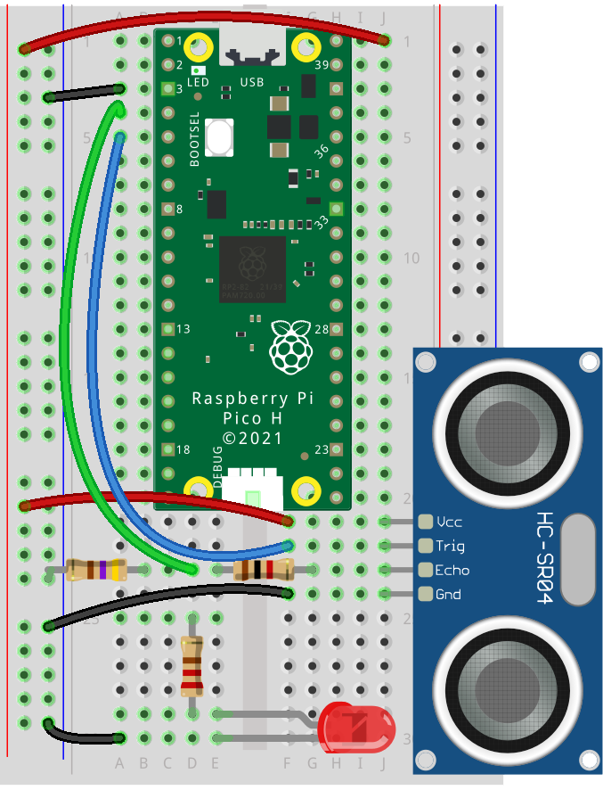
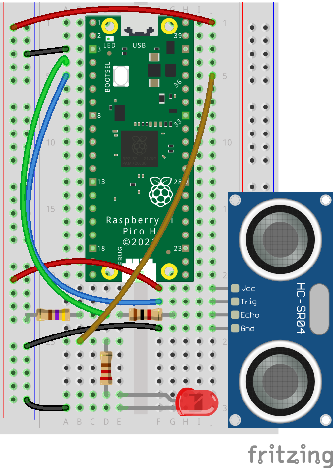
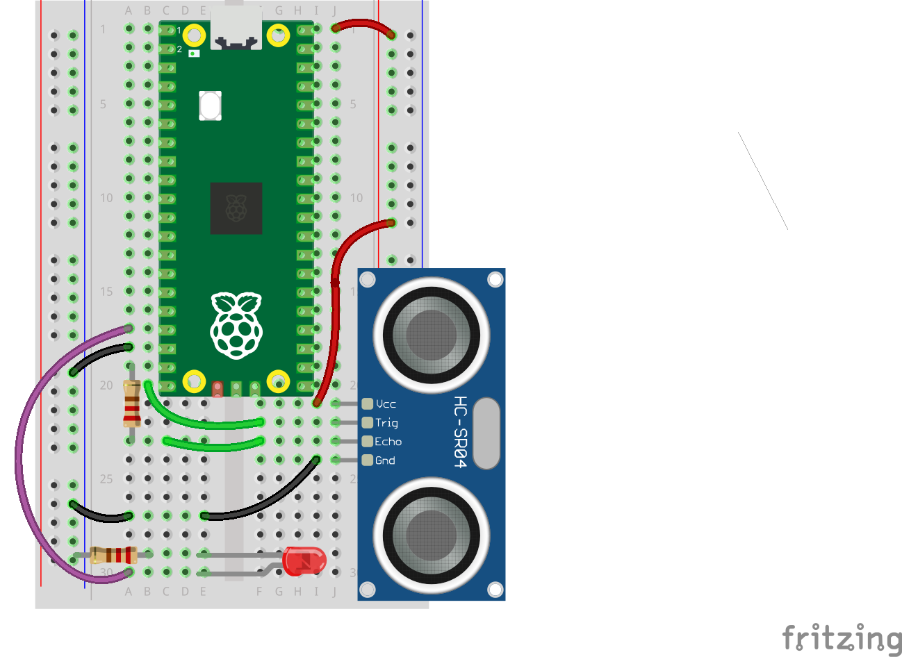

## Add the LED Indicator

--- task ---

Insert the LED into the breadboard. Place the LED so that its legs are in separate rows, allowing space to connect a resistor and jumper wires.

--- /task ---

--- task ---

Confirm which leg of the LED is longer (anode, positive) and which is shorter (cathode, negative).

--- /task ---

--- task ---

Attach the shorter leg of the LED to the ground rail on the edge of your breadboard.

--- /task ---

--- task ---
 
Attach the longer leg of the LED to one end of a **220 Ω resistor**; this resistor limits current through the LED.

--- /task ---

--- task ---

Use a jumper wire to connect the resistor to **Pin 36** to make sure that the LED lights up. This pin is always putting out 3V.

--- /task ---

--- task ---

If your LED doesn't light:
- Check you have the LED's long leg connected to the resistor and the short leg connected to GND; LEDs only work one way around.
- Check your LED is not damaged
- Ensure the LED and resistor wiring do not interfere with the sensor circuit and that no components are shorted.
- Replace the LED and check again.

--- /task ---

--- task ---

Move the jumper wire connected to the resistor from `Pin 36` to `Pin 14` on the Pico; this pin will control the LED signal.

--- /task ---